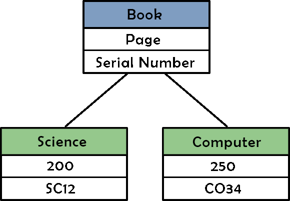
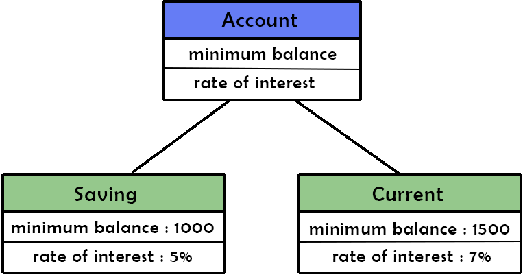

# OOP

## Introduction

To understand __Object Oriented Programming (OOP)__, think of a book having a serial number and a number of pages. Now your `science book` is __a book__ as is `computer book`. Suppose the __serial number__ of `science book` is _SC12_ and that of `computer book` is _CS34_ and the __number of pages__ are _200_ and _250_ respectively. It is like the picture below:

So, here:

- _book_ is a __`class`__.
- this class has __`attributes`__ like: _`Page`_ and _`Serial number`_.
- and _Science_ and _Computer_ are __`objects (instances)`__ of it.

So, now you understand that __`class`__ is something which acts like a base, having some definitions. And __objects__ are instances of class following those definitions.

One more example of class and objects you can think of is bank account.

- think of __Account__ as a class having attributes:
- __min_balance__ and __rate_of_interest__ and
- __Saving__ and __Current__ are its objects.

I hope you have got the feel of classes and objects. We will be dealing with programming part in later sections

## Member Functions

You already know that functions are. __Member functions__ are functions defined inside a class. For example, there can be a function named _getStrength_ inside __Student__ class to get a total number of students. Here, _getStrength_ is the member function of __Student__ class

## Inheritance

Many times, we make a __subclass__ of a class itself. The class whose subclass has been made is called __superclass__.

For example, 'Student' class can have 'BTech', 'MTech' and 'PhD' as its subclass. Here, all three subclasses will have the properties of the parent class as well as some of their new properties.

Another example can be of 'Book' as superclass and 'ScienceBook' and 'MathBook' as its subclasses.

All the shown methods and attributes of superclass will be shown by its subclass also. And subclass may have some different attributes in addition to those as well. Other names of __superclass__ and __subclass__ are __base class__ and __derived class__ respectively.

In this section, you have been introduced to some concepts of programming. In the following sections, you will go through the programming parts.
